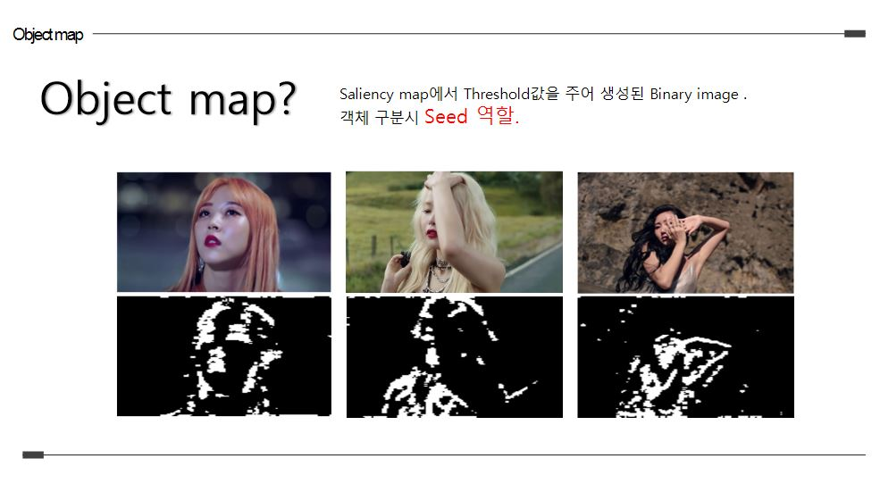

# 2D-to-3D-Conversion

> ## Summary

* **SVM(Support Vector Machine)을 활용한 OV(Object View), NOV(Non-Object View)분류**

* **OV processing : saliency + grabcut + SLIC**

* **NOV processing : Feature Learning + SLIC**

* **Pseudo DepthMap + Render**

 

 

> ## 알고리즘 소개

 

> ### 프레임 자동 분류

* ### DFT

* ### SVM

 

> ## OV(Object-View) Processing

* ### Saliency Map

 

* ### Object Map

 

- ### GrabCut

 

- ### OV DepthEstimation

 

- ### Initial PDM

 

- ### FDM

 

- ### Final PDM

 

 

> ## NOV(Non-Object-View) Processing

 

- ### Image Segmentation

 

- ### Get Feature

 

- ### Multiclass SVM

 

- ### Depth Estimation

 

> ## Rendering

- ### Result

 

> ## 참고 논문

[1] Jaeho Lee,Seungwoo Yoo,Changick Kim and Bhaskaran Vasudev "Estimating Scene-Oriented Pseudo Depth with Prictorial Depth Cues"  in IEEE TRANSACTIONS ON BROADCASTING VOL.59. NO. 2.JUNE 2013

[2] Xiaodi Hou and Liqing Zhang "Saliency Detection : A Spectral Residual Approach"  in Department of Computer Science, Shanghai Jiao Tong University.

[3] Fan Guo, Jin Tang* and Hui Peng “Automatic 2D-to-3D Image Conversion based on Depth Map Estimation”

School of Information Science and Engineering, Central South University, Changsha, Hunan, China

[4] Radhakrishna Achanta, Appu Shaji, Kevin Smith, Aurelien Lucchi, Pascal Fua, and Sabine Susstrunk  "SLIC Superpixels" in School of Computer and Communication Sciences (IC)

[5] D. Hoiem, A. Efros, and M. Hebert, “Recovering surface layout from an image,” Int. J. Comput. Vis., vol. 75, no. 1, pp. 151–172, 2007.

[6] Felzenszwalb, P. and Huttenlocher, D. 2004. Efficient graph-based image segmentation. IJCV, 59(2).

[7] T.Ojala, M.Pietikainen, and T.Maenpaa, “Multi resolution gray-scale and rotation invariant texture classification with local binary patterns,” IEEE Trans.Pattern Anal. Mach. Intell., vol.24, no.7, pp.971–987, Jul.2002.

​    

 

> ## 팀원

* **김도하**
* **전준영**
* **최욱진**
